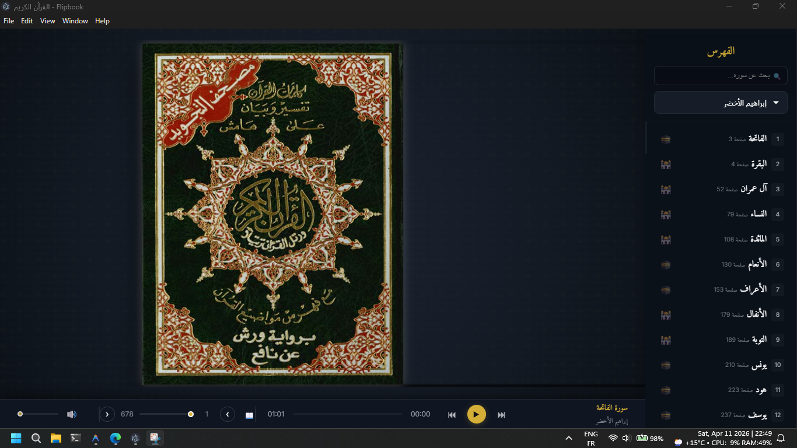

# 📖 Quran Flash

<div align="center">
  
  <br>
  <em>An elegant, responsive Electron desktop application for an authentic Quran flipbook experience.</em>
</div>

## ✨ Features

- **Immersive Flipbook Experience**: Read the Quran intuitively with realistic page-flipping animations resembling a physical Mushaf.
- **Native Desktop App**: Built on top of Electron, bringing a high-performance experience directly to Windows.
- **Modern Interface**: Edge-to-edge footer UI with beautifully designed, dark-mode inspired transparent controls.
- **Responsive Layout**: Designed to utilize screen real estate effectively, ensuring the Mushaf scales smoothly.
- **Offline Capable**: Read without an internet connection using local assets.

## 🚀 Getting Started

### Prerequisites
Make sure you have [Node.js](https://nodejs.org/) installed on your machine.

### Installation

1. Navigate to the project directory:
   ```bash
   cd Quran-Flash
   ```

2. Install the necessary dependencies:
   ```bash
   npm install
   ```

### Running Locally

To run the application in development mode:
```bash
npm run dev:full
```

### Packaging for Release

To construct an executable application installer for Windows (`.exe`):
```bash
npm run build
```
Once the build process is complete, you can find the installer in the `dist` repository folder.

## 🛠️ Technology Stack
- **Electron**: Native desktop application wrapper
- **JavaScript & HTML**: Document logic and structure
- **Vanilla CSS**: Custom styling leveraging modern glassmorphism design traits

## 📄 License
Released under the **ISC** License.